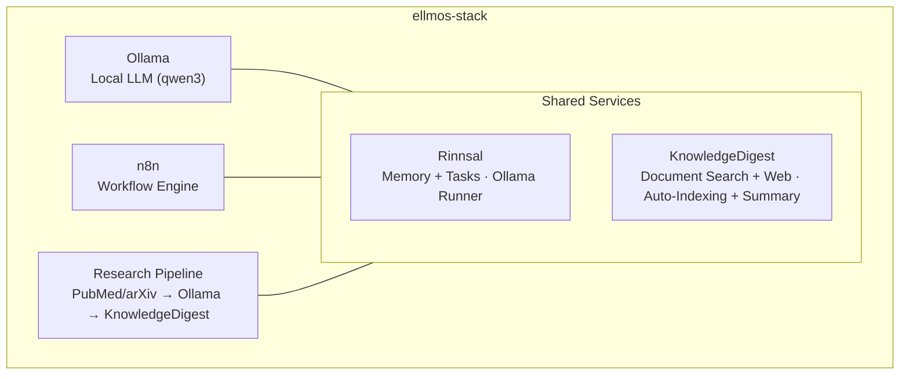

# ellmos-stack

**🇩🇪 [Deutsche Version](README_de.md)**

[](https://github.com/ellmos-ai/ellmos-stack/actions/workflows/tests.yml)

A self-hosted AI research and knowledge management stack. Combines a local LLM, workflow automation, persistent memory, and a knowledge base into one deployable setup.

**Zero cloud dependencies.** Everything runs on your own server.

Machine-readable context for LLMs and agentic coding tools: [`llms.txt`](llms.txt).

## Start here

| If you need... | Start with | Why |
|----------------|------------|-----|
| A local AI research server | [`install.sh`](install.sh) | Installs Ollama, n8n, Rinnsal and KnowledgeDigest under `/opt/ellmos-stack`. |
| Workflow automation with a local model | [`docker-compose.yml`](docker-compose.yml) | Runs n8n and Ollama with persistent volumes. |
| A searchable document inbox | [`services/auto_ingest.py`](services/auto_ingest.py) | Moves new documents into KnowledgeDigest indexing. |
| Paper search and summary pipelines | [`services/research_pipeline.py`](services/research_pipeline.py) | Searches papers, summarizes them, and can save results into the knowledge base. |
| Agent memory and task state | [ellmos-ai/rinnsal](https://github.com/ellmos-ai/rinnsal) | Provides the Python memory/task layer used by the stack. |

ellmos-stack is best read as a **local-first AI stack for research automation and private knowledge work**. It is not a hosted SaaS product, not a cloud LLM gateway, and not a Kubernetes platform.

Common discovery anchors: `ellmos-stack`, `self-hosted AI research stack`, `Ollama n8n KnowledgeDigest`, `private local RAG server`, and `Docker Compose AI knowledge base`.

## What's inside



| Component | Role | Source |
|-----------|------|--------|
| **[Ollama](https://ollama.com)** | Local LLM inference (qwen3:4b default) | Docker |
| **[n8n](https://n8n.io)** | Workflow automation, webhooks, scheduling | Docker |
| **[Rinnsal](https://github.com/ellmos-ai/rinnsal)** | Lightweight memory + task management for AI agents | pip |
| **[KnowledgeDigest](https://github.com/file-bricks/knowledgedigest)** | Document ingestion, chunking, search, web UI | pip |
| **Research Pipeline** | Automated paper search → analysis → storage | included |
| **Telegram Gateway** *(optional)* | Owner-filtered Telegram bot answering via the local LLM | included |

## Requirements

- **Server:** Linux (Ubuntu 22.04+, Debian 12+), 2+ CPU cores, 8+ GB RAM
- **Software:** Docker, Docker Compose v2, Python 3.10+
- **Disk:** ~5 GB for base setup (model + containers)

Tested on Hetzner CCX13 (2 vCPU, 8 GB RAM, ~18 EUR/month).

## Validation

The repository includes smoke tests that run without Docker, Ollama, n8n, Telegram, or live network services:

```bash
PYTHONIOENCODING=utf-8 python -m unittest discover -s tests -v
PYTHONIOENCODING=utf-8 python -m compileall -q services tests
```

GitHub Actions runs the same smoke suite on Python 3.10, 3.11, and 3.12.

## Quickstart

```bash
# Clone
git clone https://github.com/ellmos-ai/ellmos-stack.git
cd ellmos-stack

# Install (as root)
sudo ./install.sh

# That's it. Services are running:
#   n8n:              http://127.0.0.1:5678 (localhost only -- see below)
#   KnowledgeDigest:  http://your-ip:8787
#   Ollama:           localhost:11434 (internal)
```

The installer:
1. Installs system dependencies (Python, Git, curl)
2. Sets up Docker services (Ollama + n8n)
3. Pulls the configured LLM model
4. Installs Python components (Rinnsal, KnowledgeDigest)
5. Creates systemd service for KnowledgeDigest web viewer
6. Sets up cron jobs for auto-indexing and background summarization

**First n8n start -- create the owner account:** n8n 1.0+ has no Basic Auth. Authentication is handled by the owner account that you create in the web UI on first start. Because the port is bound to localhost, open it through an SSH tunnel and complete the setup before exposing anything:

```bash
ssh -L 5678:127.0.0.1:5678 root@your-server
# then open http://localhost:5678 in your local browser and create the owner account
```

## Configuration

Copy and edit `.env`:

```bash
cp .env.example .env
nano .env
```

Key settings:

| Variable | Default | Description |
|----------|---------|-------------|
| `OLLAMA_MODEL` | `qwen3:4b` | LLM model to use |
| `OLLAMA_MEMORY_LIMIT` | `6G` | Max RAM for Ollama |
| `OLLAMA_BASE_URL` | `http://localhost:11434` | Ollama endpoint used by the service scripts |
| `OLLAMA_IMAGE_TAG` | `latest` | Ollama Docker image tag -- pin before production use |
| `N8N_IMAGE_TAG` | `latest` | n8n Docker image tag -- pin before production use |
| `KD_PORT` | `8787` | KnowledgeDigest web UI port |
| `KD_SUMMARY_PROVIDER` | `ollama` | Summary backend: `ollama`, `anthropic` |

**Pin image versions for production:** the compose file defaults both Docker images to `latest`, which is convenient for evaluation but not reproducible and may pull untested breaking changes (n8n ships major releases regularly). Before production use, set `OLLAMA_IMAGE_TAG` and `N8N_IMAGE_TAG` in `.env` to the concrete versions you have tested.

## Use Cases

### 1. Knowledge Base

Drop documents (PDF, TXT, MD, DOCX) into the inbox directory:

```bash
cp paper.pdf /opt/ellmos-stack/data/knowledgedigest/inbox/
# Auto-indexed within 5 minutes, summaries generated within 15 minutes
```

Browse and search at `http://your-ip:8787`.

### 2. Research Automation

Search academic papers, analyze with your local LLM, store results:

```bash
cd /opt/ellmos-stack
venv/bin/python services/research_pipeline.py \
    "dark matter detection methods" \
    --papers 10 --summarize --save
```

### 3. AI Memory & Tasks

Persistent memory and task management for AI agents:

```python
from rinnsal import memory, tasks

memory.init("/opt/ellmos-stack/data/rinnsal/rinnsal.db")
memory.write("Server setup completed", tags=["infra"])

tasks.init("/opt/ellmos-stack/data/rinnsal/rinnsal.db")
tasks.add("Review research results", priority="high")
```

### 4. Workflow Automation (n8n)

Build automated workflows with n8n at `http://localhost:5678` (via SSH tunnel, see Quickstart):

- **Scheduled research:** Cron → Research Pipeline → Email digest
- **Document processing:** Webhook → Download → KnowledgeDigest inbox
- **Monitoring:** Health checks → Alerts

### 5. Direct LLM Access

Query Ollama directly from any service:

```bash
curl http://localhost:11434/api/generate \
    -d '{"model":"qwen3:4b","prompt":"Explain quantum entanglement briefly"}'
```

Or via Rinnsal's OllamaRunner:

```python
from rinnsal.auto import OllamaRunner

runner = OllamaRunner(model="qwen3:4b", think=False)
result = runner.run("Summarize this text: ...")
```

### 6. Desktop Document Analysis (NoteSpaceLLM)

Use [NoteSpaceLLM](https://github.com/file-bricks/NoteSpaceLLM) as a desktop client for interactive document analysis, powered by the stack's Ollama instance:

1. Install NoteSpaceLLM on your local machine
2. Set up an Ollama auth proxy (see [Exposing Ollama](#exposing-ollama-for-remote-access) below)
3. In NoteSpaceLLM: Menu > LLM > Settings > set your server URL and API key

NoteSpaceLLM provides drag-and-drop document analysis, RAG-based chat, and multi-format report export -- all processed by the stack's LLM.

### 7. Telegram Gateway (optional)

`services/telegram_gateway.py` is an owner-filtered Telegram bot: only the chat ID configured as owner may talk to it. Incoming messages are answered by the stack's local LLM (with optional Rinnsal memory context); if a `BACH_HEARTBEAT_URL` is configured and reachable, messages are forwarded there instead. Uses only the Python stdlib.

Setup:

```bash
# 1. Get a bot token from @BotFather and your chat ID from @userinfobot,
#    then set RINNSAL_TELEGRAM_TOKEN and TELEGRAM_OWNER_CHAT_ID in .env

# 2. Test the connection
/opt/ellmos-stack/venv/bin/python /opt/ellmos-stack/services/telegram_gateway.py --test

# 3. Install as systemd service (unit file is included)
cp /opt/ellmos-stack/config/telegram-gateway.service /etc/systemd/system/
systemctl daemon-reload
systemctl enable --now telegram-gateway
```

## Architecture

The stack uses **Docker** for Ollama and n8n (stateful services with volumes), and **pip packages** for the Python components (Rinnsal, KnowledgeDigest). Background processing runs via cron.

```
Port 5678  ──→ n8n (Docker, localhost only -- SSH tunnel or reverse proxy)
Port 8787  ──→ KnowledgeDigest Web Viewer (systemd)
Port 11434 ──→ Ollama (Docker, localhost only)
Port 11435 ──→ Ollama Auth Proxy (Nginx, optional, for remote clients)

Cron:
  */5  min ──→ auto_ingest.py (index new documents)
  */15 min ──→ process_summaries.py (LLM summarization)
```

Data is stored in `/opt/ellmos-stack/data/` (SQLite databases, document files).

## Customization

### Different LLM model

```bash
# Edit .env
OLLAMA_MODEL=mistral:7b

# Pull the new model
docker exec ollama ollama pull mistral:7b

# For NoteSpaceLLM RAG embeddings, also pull an embedding model:
docker exec ollama ollama pull nomic-embed-text

# Restart summary processing (uses OLLAMA_MODEL from .env)
```

### Cloud LLM for summaries

```bash
# In .env
KD_SUMMARY_PROVIDER=anthropic
ANTHROPIC_API_KEY=sk-ant-...
```

### Custom system prompt

Edit `config/system_prompt.txt` to adjust the LLM's personality, language, and behavior.

## Exposing Ollama for Remote Access

By default, Ollama only listens on localhost. To allow desktop clients (like NoteSpaceLLM) or other machines to use your stack's LLM, set up an Nginx reverse proxy with API key authentication:

```bash
# Install Nginx
apt install nginx

# Create proxy config
cat > /etc/nginx/sites-available/ollama-proxy << 'EOF'
server {
    listen 11435;
    server_name _;

    location / {
        if ($http_authorization != "Bearer YOUR_SECRET_API_KEY") {
            return 401 "Unauthorized";
        }
        proxy_pass http://127.0.0.1:11434;
        proxy_set_header Host $host;
        proxy_read_timeout 300s;
        proxy_buffering off;
    }

    # Unauthenticated health endpoint
    location /health {
        proxy_pass http://127.0.0.1:11434/api/tags;
        proxy_read_timeout 5s;
    }
}
EOF

# Enable and start
ln -sf /etc/nginx/sites-available/ollama-proxy /etc/nginx/sites-enabled/
ufw allow 11435/tcp
systemctl reload nginx
```

Generate a secure key: `python3 -c "import secrets; print(secrets.token_urlsafe(32))"`

Clients then connect to `http://your-server:11435` with the header `Authorization: Bearer YOUR_SECRET_API_KEY`.

## Security Notes

- n8n is bound to `127.0.0.1:5678` by default and is **not** reachable from outside. n8n 1.0+ removed Basic Auth; authentication is handled by the n8n owner account, which you must create in the web UI on first start (via SSH tunnel, see Quickstart). **Never expose an n8n instance before the owner account exists** -- the first visitor would become the owner.
- To deliberately make n8n reachable from outside, either keep the localhost binding and put a TLS reverse proxy (Nginx/Caddy) in front of `127.0.0.1:5678`, or change the port mapping in `docker-compose.yml` to `"0.0.0.0:5678:5678"` and protect it with a firewall -- only after the owner account is set up
- Ollama listens on localhost only by default (not exposed to the internet)
- The optional Ollama proxy (port 11435) uses Bearer token authentication
- All credentials are in `.env` (never committed to git)
- KnowledgeDigest web viewer should be secured with a reverse proxy (e.g., Nginx Basic Auth on port 8788, block direct access to 8787 via firewall)

## Search and disambiguation

Use **ellmos-stack** when you mean the self-hosted local AI research stack from `ellmos-ai`: Ollama for inference, n8n for workflow automation, Rinnsal for agent memory/tasks, and KnowledgeDigest for document search. Useful search phrases include:

- `ellmos-stack self-hosted AI research stack`
- `ellmos stack Ollama n8n Rinnsal KnowledgeDigest`
- `local-first AI knowledge stack Docker Compose`
- `self-hosted research automation Ollama n8n`
- `private local RAG server with Ollama and n8n`
- `Docker Compose AI knowledge base with document search`
- `self-hosted AI starter stack for research workflows`

The project is unrelated to Eclipse LMOS, Llama Stack, LLemonStack, generic n8n AI starter kits, Open WebUI-only deployments, general LLMOps stacks, or cloud-hosted AI agent platforms. Use the canonical repo path `ellmos-ai/ellmos-stack` when disambiguating search results.

## Stack Family

ellmos-stack is the **all-in-one starter stack** — the reference implementation with everything included. Future specialized stacks will build on the same base components (Ollama + n8n + Rinnsal) with domain-specific extensions:

| Stack | Focus | Components |
|-------|-------|------------|
| **ellmos-stack** (this repo) | All-in-one knowledge & research | Ollama + n8n + Rinnsal + KnowledgeDigest + Research Pipeline |
| ellmos-research-stack | Academic research & literature | + PubMed/arXiv pipelines, bibliography tools, citation networks |
| ellmos-dev-stack | Software development & DevOps | + Code analysis, CI/CD integration, repo monitoring |
| ellmos-media-stack | Content creation & media | + Transcription, summarization pipelines, media processing |

Each stack is a self-contained repo with its own `docker-compose.yml` and `install.sh`. They share the base infrastructure but add domain-specific tools and workflows.

## Part of the ellmos ecosystem

| Component | Description |
|-----------|-------------|
| [ellmos-ai/rinnsal](https://github.com/ellmos-ai/rinnsal) | Lightweight AI memory & task management |
| [file-bricks/knowledgedigest](https://github.com/file-bricks/knowledgedigest) | Document knowledge base with web UI |
| [file-bricks/NoteSpaceLLM](https://github.com/file-bricks/NoteSpaceLLM) | Desktop document analysis & RAG chat (connects to stack's Ollama) |
| [research-line/research-agent](https://github.com/research-line/research-agent) | Academic paper search & analysis |

## License

MIT

---

## Haftung / Liability

Dieses Projekt ist eine **unentgeltliche Open-Source-Schenkung** im Sinne der §§ 516 ff. BGB. Die Haftung des Urhebers ist gemäß **§ 521 BGB** auf **Vorsatz und grobe Fahrlässigkeit** beschränkt. Ergänzend gelten die Haftungsausschlüsse aus GPL-3.0 / MIT / Apache-2.0 §§ 15–16 (je nach gewählter Lizenz).

Nutzung auf eigenes Risiko. Keine Wartungszusage, keine Verfügbarkeitsgarantie, keine Gewähr für Fehlerfreiheit oder Eignung für einen bestimmten Zweck.

This project is an unpaid open-source donation. Liability is limited to intent and gross negligence (§ 521 German Civil Code). Use at your own risk. No warranty, no maintenance guarantee, no fitness-for-purpose assumed.

