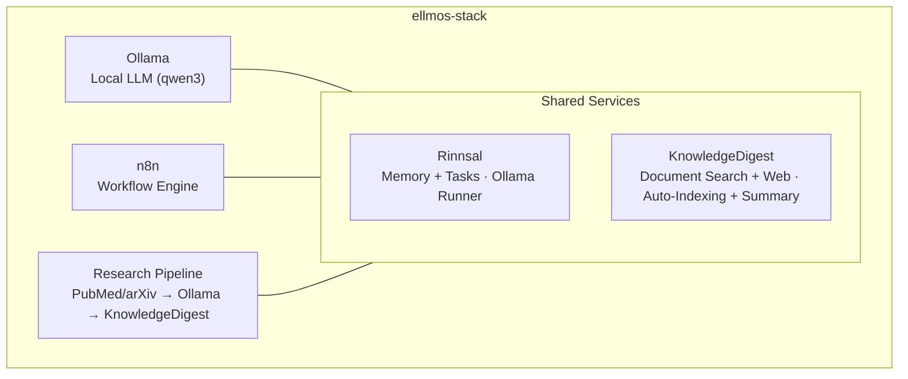

# ellmos-stack

**🇩🇪 [Deutsche Version](README_de.md)**

[](https://github.com/ellmos-ai/ellmos-stack/actions/workflows/tests.yml)
[](https://github.com/ellmos-ai/ellmos-stack/releases)
[](LICENSE)

A self-hosted AI research and knowledge management stack. Combines a local LLM, workflow automation, persistent memory, and a knowledge base into one deployable setup.

**No hosted model dependency by default.** Inference, workflow state, memory, and documents stay on your server. Paper search (PubMed/arXiv), Telegram, package/image downloads, and the optional Anthropic summary backend require network access.

Machine-readable context for LLMs and agentic coding tools: [`llms.txt`](llms.txt).

## Start here

| If you need... | Start with | Why |
|----------------|------------|-----|
| A local AI research server | [`install.sh`](install.sh) | Installs Ollama, n8n, Rinnsal and KnowledgeDigest under `/opt/ellmos-stack`. |
| Workflow automation with a local model | [`docker-compose.yml`](docker-compose.yml) | Runs n8n and Ollama with persistent volumes. |
| A searchable document inbox | [`services/auto_ingest.py`](services/auto_ingest.py) | Moves new documents into KnowledgeDigest indexing. |
| Paper search and summary pipelines | [`services/research_pipeline.py`](services/research_pipeline.py) | Searches papers, summarizes them, and can save results into the knowledge base. |
| Agent memory and task state | [ellmos-ai/rinnsal](https://github.com/ellmos-ai/rinnsal) | Provides the Python memory/task layer used by the stack. |

ellmos-stack is best read as a **local-first AI stack for research automation and private knowledge work**. It is not a hosted SaaS product, not a cloud LLM gateway, and not a Kubernetes platform.

Common discovery anchors: `ellmos-stack`, `self-hosted AI research stack`, `Ollama n8n KnowledgeDigest`, `private local RAG server`, and `Docker Compose AI knowledge base`.

## What's inside


```mermaid
flowchart TD
  subgraph STACK["ellmos-stack"]
    OLLAMA["Ollama<br/>Local LLM (qwen3)"]
    N8N["n8n<br/>Workflow Engine"]
    RESEARCH["Research Pipeline<br/>PubMed/arXiv → Ollama → KnowledgeDigest"]
    subgraph SHARED["Shared Services"]
      RIN["Rinnsal<br/>Memory + Tasks · Ollama Runner"]
      KD["KnowledgeDigest<br/>Document Search + Web · Auto-Indexing + Summary"]
    end
  end
  OLLAMA --- SHARED
  N8N --- SHARED
  RESEARCH --- SHARED
```

| Component | Role | Source |
|-----------|------|--------|
| **[Ollama](https://ollama.com)** | Local LLM inference (qwen3:4b default) | Docker |
| **[n8n](https://n8n.io)** | Workflow automation, webhooks, scheduling | Docker |
| **[Rinnsal](https://github.com/ellmos-ai/rinnsal)** | Lightweight memory + task management for AI agents | pinned Git commit |
| **[KnowledgeDigest](https://github.com/file-bricks/knowledgedigest)** | Document ingestion, chunking, search, web UI | pinned Git commit |
| **Research Pipeline** | PubMed/arXiv API search → analysis → storage | included |
| **Telegram Gateway** *(optional)* | Owner-filtered Telegram bot answering via the local LLM | included |

## Composition at a glance

```
ellmos-stack (Docker Compose)
├── Inference       Ollama            local LLM (qwen3:4b)
├── Automation      n8n               workflows, webhooks, scheduling
├── Knowledge/RAG   KnowledgeDigest   ingest → chunk → FTS5 → summarize
├── Memory & Tasks  rinnsal           agent memory/task state (pinned-git)
├── services/       research_pipeline, auto_ingest, process_summaries,
│                   telegram_gateway, env_config
└── External APIs   PubMed · arXiv    paper search (https)
```

Full composition blueprint — components, roles, sources, policies: **[STACK-MAP.md](STACK-MAP.md)**.

## Requirements

- **Server:** Linux (Ubuntu 22.04+, Debian 12+), 2+ CPU cores, 8+ GB RAM
- **Software:** Docker, Docker Compose v2, Python 3.10+
- **Disk:** ~5 GB for base setup (model + containers)

## Validation

The repository includes smoke tests that run without Docker, Ollama, n8n, Telegram, or live network services:

```bash
PYTHONIOENCODING=utf-8 python -m unittest discover -s tests -v
PYTHONIOENCODING=utf-8 python -m compileall -q services tests tools
PYTHONIOENCODING=utf-8 python tools/check_release_gate.py
```

The standard GitHub Actions workflow runs compilation and the full unit suite on Python 3.10, 3.11, and 3.12. The manual release workflow additionally runs the static release checker and Linux Compose probes.

These checks are an offline preflight, not a Linux deployment claim. Public releases use the separate [stack release gate](RELEASE_GATE.md): exact container tags, a real Linux Docker Compose startup/probe, localhost-binding checks, and an owner-account/TLS/firewall review. Floating `latest` tags fail that release gate.

## Quickstart

```bash
# Clone
git clone https://github.com/ellmos-ai/ellmos-stack.git
cd ellmos-stack

# Install (as root)
sudo ./install.sh

# That's it. Services are running:
#   n8n:              http://127.0.0.1:5678 (localhost only -- see below)
#   KnowledgeDigest:  http://127.0.0.1:8787 (localhost only -- see below)
#   Ollama:           localhost:11434 (internal)
```

The installer:
1. Installs system dependencies (Python, Git, curl)
2. Sets up Docker services (Ollama + n8n)
3. Pulls the configured LLM model
4. Installs pinned Rinnsal and KnowledgeDigest commits into a Python venv
5. Creates a restricted `ellmos-stack` system user and systemd service for KnowledgeDigest
6. Sets up non-root cron jobs for auto-indexing and background summarization

**First n8n start -- create the owner account:** n8n 1.0+ has no Basic Auth. Authentication is handled by the owner account that you create in the web UI on first start. Because the port is bound to localhost, open it through an SSH tunnel and complete the setup before exposing anything:

```bash
ssh -L 5678:127.0.0.1:5678 -L 8787:127.0.0.1:8787 root@your-server
# then open http://localhost:5678 for n8n and http://localhost:8787 for KnowledgeDigest
```

## Configuration

Copy and edit `.env`:

```bash
cp .env.example .env
nano .env
```

Key settings:

| Variable | Default | Description |
|----------|---------|-------------|
| `OLLAMA_MODEL` | `qwen3:4b` | LLM model to use |
| `OLLAMA_MEMORY_LIMIT` | `6G` | Max RAM for Ollama |
| `OLLAMA_BASE_URL` | `http://localhost:11434` | Ollama endpoint used by the service scripts |
| `OLLAMA_IMAGE_TAG` | `latest` | Ollama Docker image tag -- pin before production use |
| `N8N_IMAGE_TAG` | `latest` | n8n Docker image tag -- pin before production use |
| `KD_PORT` | `8787` | KnowledgeDigest web UI port |
| `KD_SUMMARY_PROVIDER` | `ollama` | Summary backend: `ollama`, `anthropic` |

**Pin image versions for production:** the compose file defaults both Docker images to `latest`, which is convenient for evaluation but not reproducible and may pull untested breaking changes (n8n ships major releases regularly). Before production use, set `OLLAMA_IMAGE_TAG` and `N8N_IMAGE_TAG` in `.env` to the concrete versions you have tested.

## Use Cases

### 1. Knowledge Base

Drop documents (PDF, TXT, MD, DOCX) into the inbox directory:

```bash
cp paper.pdf /opt/ellmos-stack/data/knowledgedigest/inbox/
# Auto-indexed within 5 minutes, summaries generated within 15 minutes
```

Browse and search at `http://localhost:8787` through the SSH tunnel from Quickstart. Keep the service on localhost unless a reviewed TLS/authentication reverse proxy and firewall rule are in place.

### 2. Research Automation

Search academic papers, analyze with your local LLM, store results:

```bash
cd /opt/ellmos-stack
venv/bin/python services/research_pipeline.py \
    "dark matter detection methods" \
    --papers 10 --summarize --save
```

The built-in, dependency-free search client uses [NCBI E-utilities for PubMed](https://www.ncbi.nlm.nih.gov/home/develop/api/) and the [arXiv API](https://info.arxiv.org/help/api/index.html). Select one source with `--source pubmed` or `--source arxiv`; paper search requires outbound network access.

### 3. AI Memory & Tasks

Persistent memory and task management for AI agents:

```python
from rinnsal.memory import api as memory
from rinnsal.tasks import api as tasks

db_path = "/opt/ellmos-stack/data/rinnsal/rinnsal.db"
memory.init(db_path=db_path, agent_id="ellmos-stack")
memory.remember("server_setup", "completed", category="project")

tasks.init(db_path=db_path, agent_id="ellmos-stack")
tasks.add("Review research results", priority="high")
```

### 4. Workflow Automation (n8n)

Build automated workflows with n8n at `http://localhost:5678` (via SSH tunnel, see Quickstart):

- **Scheduled research:** Cron → Research Pipeline → Email digest
- **Document processing:** Webhook → Download → KnowledgeDigest inbox
- **Monitoring:** Health checks → Alerts

### 5. Direct LLM Access

Query Ollama directly from any service:

```bash
curl http://localhost:11434/api/generate \
    -d '{"model":"qwen3:4b","prompt":"Explain quantum entanglement briefly"}'
```

Or via Rinnsal's OllamaRunner:

```python
from rinnsal.auto.ollama_runner import OllamaRunner

runner = OllamaRunner(model="qwen3:4b", think=False)
result = runner.run("Summarize this text: ...")
```

### 6. Desktop Document Analysis (NoteSpaceLLM)

Use [NoteSpaceLLM](https://github.com/file-bricks/NoteSpaceLLM) as a desktop client for interactive document analysis, powered by the stack's Ollama instance:

1. Install NoteSpaceLLM on your local machine
2. Set up an Ollama auth proxy (see [Exposing Ollama](#exposing-ollama-for-remote-access) below)
3. In NoteSpaceLLM: Menu > LLM > Settings > set your server URL and API key

NoteSpaceLLM provides drag-and-drop document analysis, RAG-based chat, and multi-format report export -- all processed by the stack's LLM.

### 7. Telegram Gateway (optional)

`services/telegram_gateway.py` is an owner-filtered Telegram bot: only the configured owner chat ID may talk to it. Incoming messages are answered by the stack's local LLM with optional Rinnsal memory context. The gateway has no BACH forwarding path. It uses only the Python standard library.

Setup:

```bash
# 1. Get a bot token from @BotFather and your chat ID from @userinfobot,
#    then set RINNSAL_TELEGRAM_TOKEN and TELEGRAM_OWNER_CHAT_ID in .env

# 2. Test the connection
/opt/ellmos-stack/venv/bin/python /opt/ellmos-stack/services/telegram_gateway.py --test

# 3. Install as systemd service (unit file is included)
cp /opt/ellmos-stack/config/telegram-gateway.service /etc/systemd/system/
systemctl daemon-reload
systemctl enable --now telegram-gateway
```

## Architecture

The stack uses **Docker** for Ollama and n8n (stateful services with volumes), and installs the Python components (Rinnsal, KnowledgeDigest) from pinned Git commits into a venv. KnowledgeDigest and background cron processing run as the restricted `ellmos-stack` user.

```
Port 5678  ──→ n8n (Docker, localhost only -- SSH tunnel or reverse proxy)
Port 8787  ──→ KnowledgeDigest Web Viewer (systemd, localhost only)
Port 11434 ──→ Ollama (Docker, localhost only)
Port 443   ──→ TLS Ollama reverse proxy (optional, for remote clients)

Cron:
  */5  min ──→ auto_ingest.py (index new documents)
  */15 min ──→ process_summaries.py (LLM summarization)
```

Data is stored in `/opt/ellmos-stack/data/` (SQLite databases, document files).

## Customization

### Different LLM model

```bash
# Edit .env
OLLAMA_MODEL=mistral:7b

# Pull the new model
docker exec ollama ollama pull mistral:7b

# For NoteSpaceLLM RAG embeddings, also pull an embedding model:
docker exec ollama ollama pull nomic-embed-text

# Restart summary processing (uses OLLAMA_MODEL from .env)
```

### Cloud LLM for summaries

```bash
# In .env
KD_SUMMARY_PROVIDER=anthropic
ANTHROPIC_API_KEY=sk-ant-...
```

### Custom system prompt

Edit `config/system_prompt.txt` to adjust the LLM's personality, language, and behavior.

## Exposing Ollama for Remote Access

By default, Ollama only listens on localhost. For remote clients, keep that binding and use a TLS reverse proxy with a bearer token. Obtain a certificate for `ollama.example.com` first; never send the token over plain HTTP.

```bash
# Install Nginx
apt install nginx

# Create proxy config
cat > /etc/nginx/sites-available/ollama-proxy << 'EOF'
server {
    listen 443 ssl;
    server_name ollama.example.com;

    ssl_certificate /etc/letsencrypt/live/ollama.example.com/fullchain.pem;
    ssl_certificate_key /etc/letsencrypt/live/ollama.example.com/privkey.pem;

    location / {
        if ($http_authorization != "Bearer YOUR_SECRET_API_KEY") {
            return 401 "Unauthorized";
        }
        proxy_pass http://127.0.0.1:11434;
        proxy_set_header Host $host;
        proxy_read_timeout 300s;
        proxy_buffering off;
    }

}
EOF

# Enable and start
chmod 600 /etc/nginx/sites-available/ollama-proxy
ln -sf /etc/nginx/sites-available/ollama-proxy /etc/nginx/sites-enabled/
nginx -t
ufw allow 443/tcp
systemctl reload nginx
```

Generate a secure key: `python3 -c "import secrets; print(secrets.token_urlsafe(32))"`

Clients then connect to `https://ollama.example.com` with the header `Authorization: Bearer YOUR_SECRET_API_KEY`.

## Security Notes

- n8n is bound to `127.0.0.1:5678` by default and is **not** reachable from outside. n8n 1.0+ removed Basic Auth; authentication is handled by the n8n owner account, which you must create in the web UI on first start (via SSH tunnel, see Quickstart). **Never expose an n8n instance before the owner account exists** -- the first visitor would become the owner.
- For remote n8n access, keep the localhost binding and use a reviewed TLS/authentication reverse proxy, SSH tunnel, or private VPN. Never expose the raw HTTP port 5678 to the public internet, even after the owner account exists
- Ollama listens on localhost only by default (not exposed to the internet)
- The optional Ollama proxy uses TLS plus bearer-token authentication; a bearer token over plain HTTP is not secure
- All credentials are in `.env` (never committed to git); the installer restricts that file to the owner (`0600`)
- KnowledgeDigest binds to localhost by default; external access requires a reviewed TLS/authentication reverse proxy and firewall rule
- The Telegram gateway refuses to start unless both the bot token and owner chat ID are configured
- Rinnsal and KnowledgeDigest installer inputs are pinned to exact commits; upgrades are explicit source changes
- Review [`OPERATIONS.md`](OPERATIONS.md) and rehearse restore before an upgrade or release

## Search and disambiguation

Use **ellmos-stack** when you mean the self-hosted local AI research stack from `ellmos-ai`: Ollama for inference, n8n for workflow automation, Rinnsal for agent memory/tasks, and KnowledgeDigest for document search. Useful search phrases include:

- `ellmos-stack self-hosted AI research stack`
- `ellmos stack Ollama n8n Rinnsal KnowledgeDigest`
- `local-first AI knowledge stack Docker Compose`
- `self-hosted research automation Ollama n8n`
- `private local RAG server with Ollama and n8n`
- `Docker Compose AI knowledge base with document search`
- `self-hosted AI starter stack for research workflows`

The project is unrelated to Eclipse LMOS, Llama Stack, LLemonStack, generic n8n AI starter kits, Open WebUI-only deployments, general LLMOps stacks, or cloud-hosted AI agent platforms. Use the canonical repo path `ellmos-ai/ellmos-stack` when disambiguating search results.

## Stack Family

> **Canonical catalog:** the full, up-to-date list of all ellmos stacks lives in
> **[ellmos-ai/stacks](https://github.com/ellmos-ai/stacks)** — the stacks overview repo
> (catalog, shared manifest schema, "what is a stack" docs). The table below is a
> convenience excerpt; when in doubt, the catalog wins.

ellmos-stack is the **all-in-one starter stack** — the reference implementation with everything included. Sibling stacks build on shared principles with domain-specific focus:

| Stack | Focus | Components |
|-------|-------|------------|
| **ellmos-stack** (this repo) | All-in-one knowledge & research | Ollama + n8n + Rinnsal + KnowledgeDigest + Research Pipeline |
| [agent-ops-stack](https://github.com/ellmos-ai/agent-ops-stack) | Multi-agent operations (locks, tickets, decision avatar, memory) | ticket-master + lock-master + build-your-users-mind + skills + controlcenter-mcp + homebase-mcp |
| ellmos-research-stack (planned) | Academic research & literature | + PubMed/arXiv pipelines, bibliography tools, citation networks |
| ellmos-dev-stack (planned) | Software development & DevOps | + Code analysis, CI/CD integration, repo monitoring |
| ellmos-media-stack (planned) | Content creation & media | + Transcription, summarization pipelines, media processing |

Each stack is a self-contained repo with its own manifest and `install.sh`. They share the composition principle ("installation IS the blueprint") but add domain-specific tools and workflows.

## Part of the ellmos ecosystem

| Component | Description |
|-----------|-------------|
| [ellmos-ai/rinnsal](https://github.com/ellmos-ai/rinnsal) | Lightweight AI memory & task management |
| [file-bricks/knowledgedigest](https://github.com/file-bricks/knowledgedigest) | Document knowledge base with web UI |
| [file-bricks/NoteSpaceLLM](https://github.com/file-bricks/NoteSpaceLLM) | Desktop document analysis & RAG chat (connects to stack's Ollama) |
| [PubMed E-utilities](https://www.ncbi.nlm.nih.gov/home/develop/api/) and [arXiv API](https://info.arxiv.org/help/api/index.html) | Live academic-paper metadata search used by the included research pipeline |

## License

MIT

---

## Haftung / Liability

Dieses Projekt ist eine **unentgeltliche Open-Source-Schenkung** im Sinne der §§ 516 ff. BGB. Die Haftung des Urhebers ist gemäß **§ 521 BGB** auf **Vorsatz und grobe Fahrlässigkeit** beschränkt. Ergänzend gelten die Haftungsausschlüsse aus GPL-3.0 / MIT / Apache-2.0 §§ 15–16 (je nach gewählter Lizenz).

Nutzung auf eigenes Risiko. Keine Wartungszusage, keine Verfügbarkeitsgarantie, keine Gewähr für Fehlerfreiheit oder Eignung für einen bestimmten Zweck.

This project is an unpaid open-source donation. Liability is limited to intent and gross negligence (§ 521 German Civil Code). Use at your own risk. No warranty, no maintenance guarantee, no fitness-for-purpose assumed.

